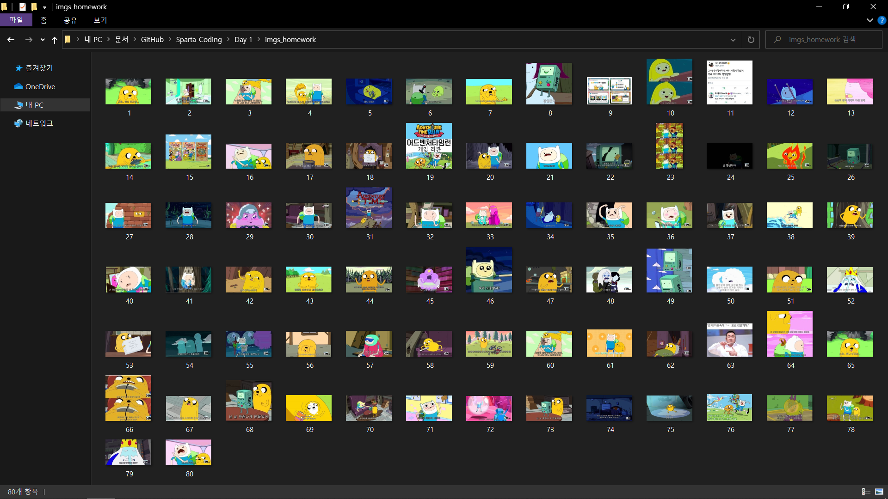
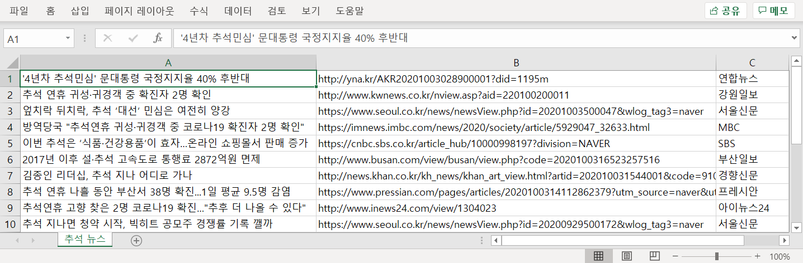
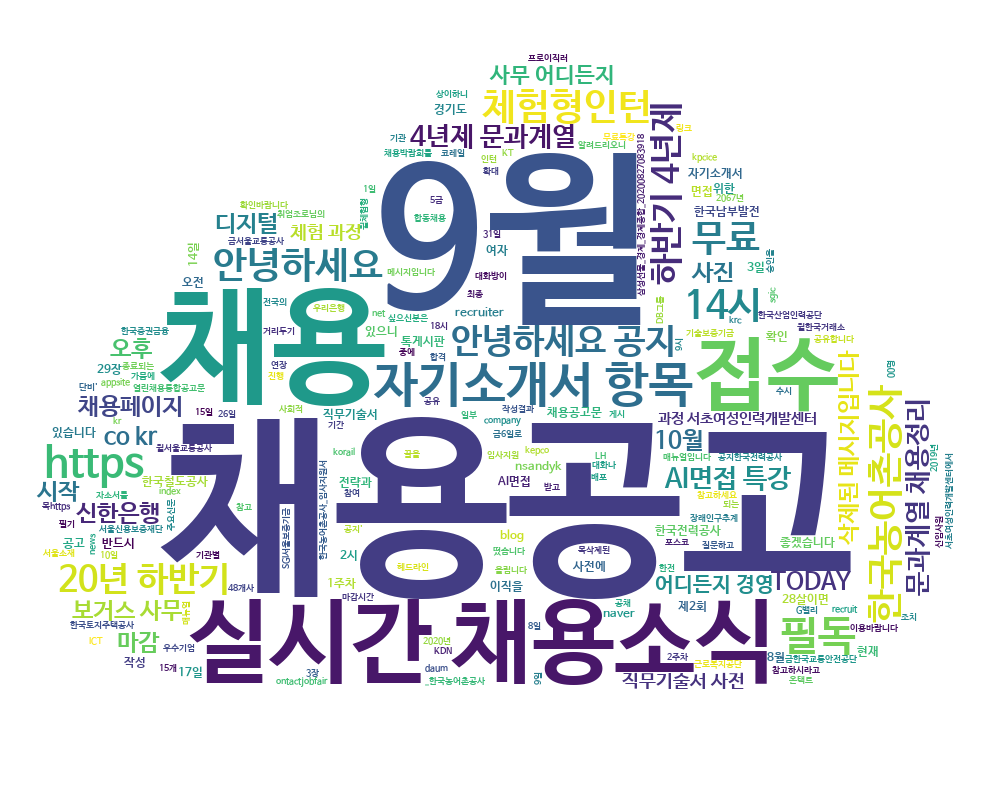
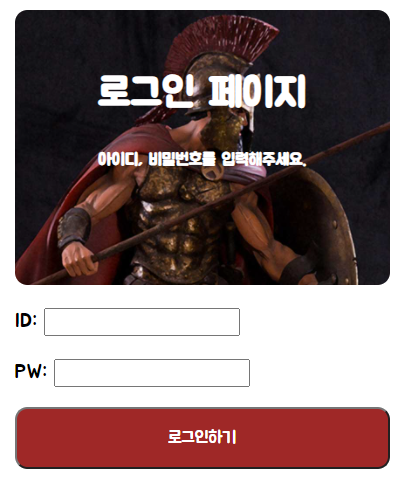

# Sparta-Coding  

- Python
- Day 0: Review the `Basics`  
- Day 1: `Crawling` Data  
- Day 2: Saving as `Excel`  
- Day 3: Creating `Word Cloud`  

- HTML, CSS, JavaScript  
- Day 1: Create `HTML` & `CSS`  
- Day 2: Merry Christmas with `JavaScript`  

## Link  

- [Sparta Coding](https://spartacodingclub.kr/)

## 1. Python

### Day 1  
  

### Day 2  
  

### Day 3  
  

## 2. HTML, CSS, JavsScript

### Day 1 
  

### Day 2
  
