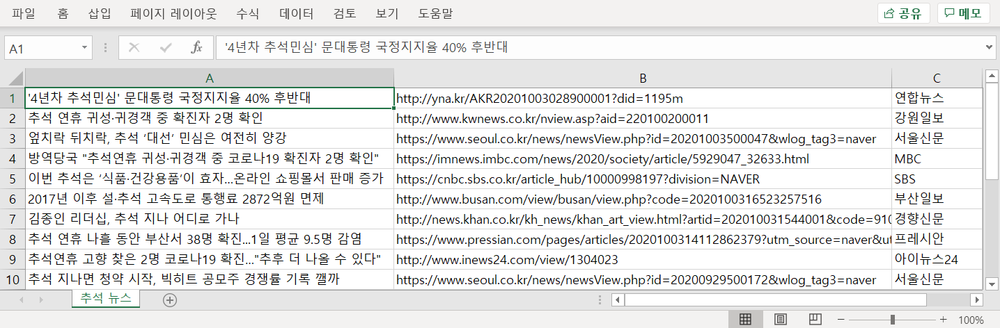
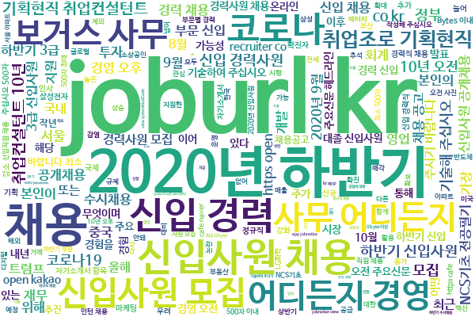

# Sparta-Coding

- Day 0: Review the `Basics`  
- Day 1: `Crawling` Data  
- Day 2: Saving as `Excel`  
- Day 3: Creating `Word Cloud`

## Link

- [Sparta Coding](https://spartacodingclub.kr/)

### Day 1  
  

### Day 2
  

### Day 3  
  

  
